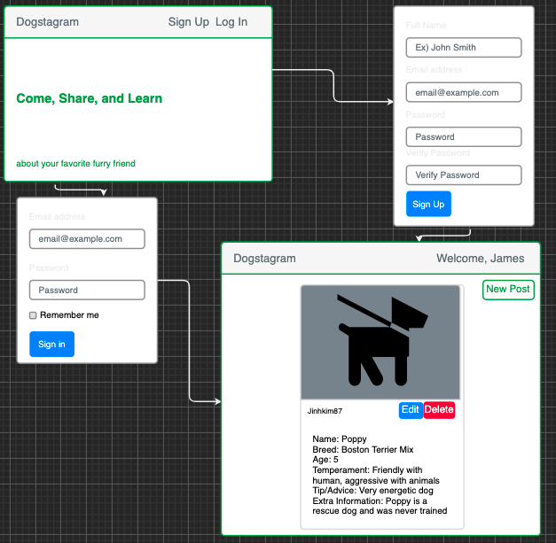
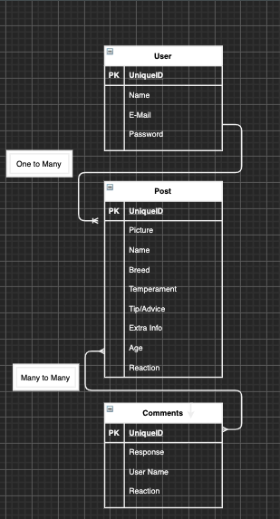

# Dogstagram

# ApplicationName

Dogstagram

## Concept:

This social media platform will give users a better understanding about dog and the breed.
User will be able to post, read, edit, and delete.
User will be able to post a picture of their dog, breed, age, temperament, rescue/breeder, and any tips/advice by the owner on the breed.

## User Story:

As a user, I will see an intro page with an option of Sign up and Log In as options
As a user, when I click Sign Up, it'll direct me to sign up page where you will be able to sign up
AAU, I want to click on Log In, so that I can sign into my account.
AAU, when I complete either one of these, it'll direct me to the main page where I will be able to post a new post, edit/delete my previous post, and view other people's posts.

ERD
One to Many - User (Name, e-mail, password)
-> post (Picture, String of text)

Many to Many - Post (Picture, String of Text)
-> Comments (User name)

## Wireframes:

## Technologies Used:

- HTML
- CSS
- JavaScript
- EJS
- Express
- Mongoose
- Node

## Approach:

## Challenges:

## Next Steps:

-Log out
-Able to post pictures
-Comment/Questions on the Post.

## App Demo

https://agile-mesa-51957.herokuapp.com/
